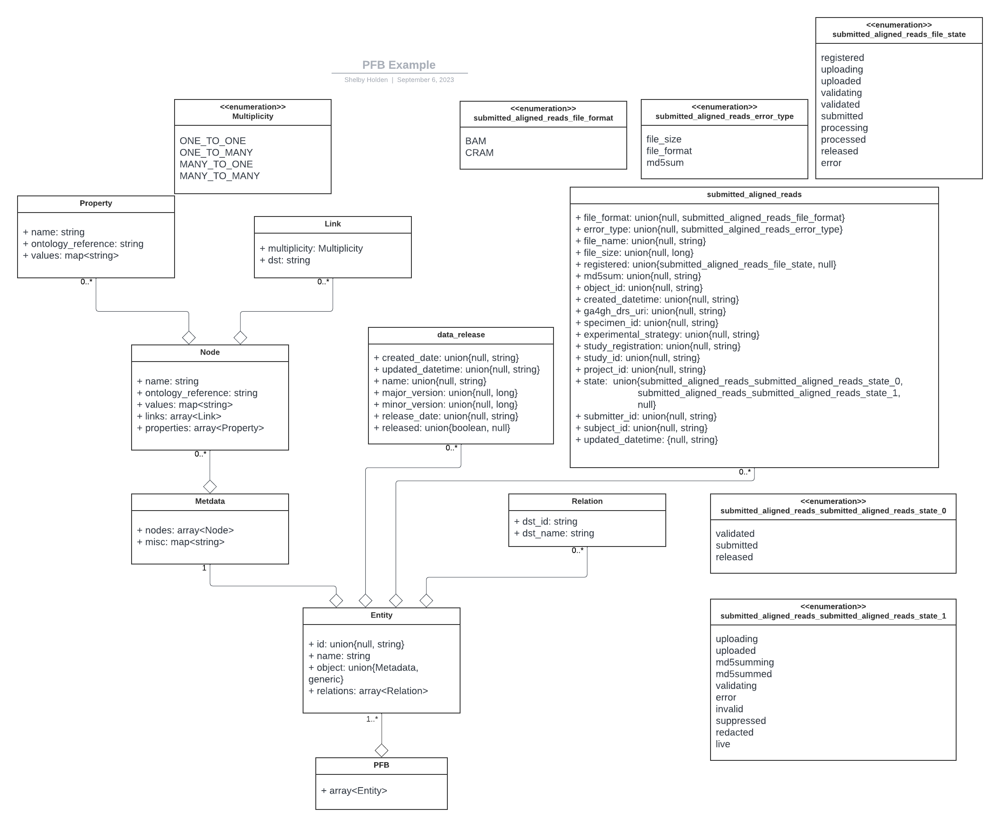
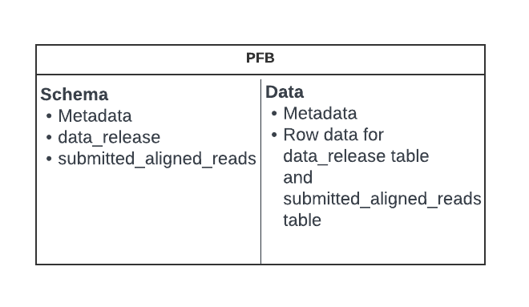
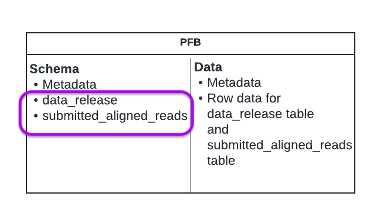
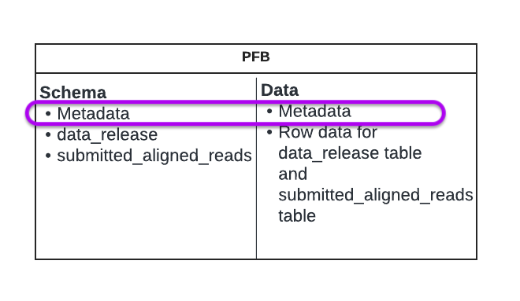
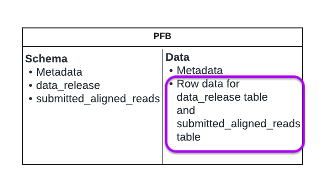

# Example walkthrough of PFB


With some example row data that looks like the following:

```json
{"id": "HG01101_cram", "name": "submitted_aligned_reads", "object": {"file_format": "BAM", "error_type": "file_size", "file_name": "foo.bam", "file_size": 512, "file_state": "registered", "md5sum": "bdf121aadba028d57808101cb4455fa7", "object_id": "dg.4503/cc32d93d-a73c-4d2c-a061-26c0410e74fa", "created_datetime": null, "ga4gh_drs_uri": "drs://example.org/dg.4503/cc32d93d-a73c-4d2c-a061-26c0410e74fa", "participant_id": "bbb1234", "specimen_id": "spec1111", "experimental_strategy": null, "study_registration": "example.com/study_registration", "study_id": "aaa1234", "project_id": "DEV-test", "state": "uploading", "submitter_id": "HG01101_cram", "subject_id": "p1011554-9", "updated_datetime": null}, "relations": []}
```


This boils down to the following components:




# Example output of commands

### Show schema
```
 ./gradlew run --args="show -i ../library/src/test/resources/avro/minmal_data.avro schema"
```
This effectively returns the schema for the data specific to this PFB file (the part outlined in purple below).



### Show Metadata
```
 ./gradlew run --args="show -i ../library/src/test/resources/avro/minmal_data.avro metadata"
```
The show metadata command returns the PFB Metadata object.



### Show Nodes
```
 ./gradlew run --args="show -i ../library/src/test/resources/avro/minmal_data.avro nodes"
```
The show nodes command returns a list of the names of the tables unique to this PFB file.

```
data_release
submitted_aligned_reads
```

### Show
```
 ./gradlew run --args="show -i ../library/src/test/resources/avro/minmal_data.avro"
```
The show command returns the row data.

