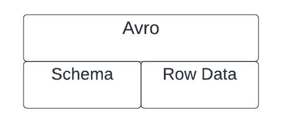
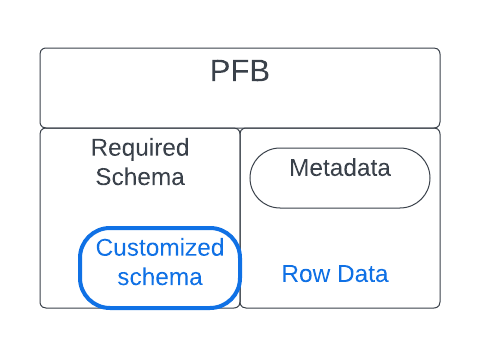
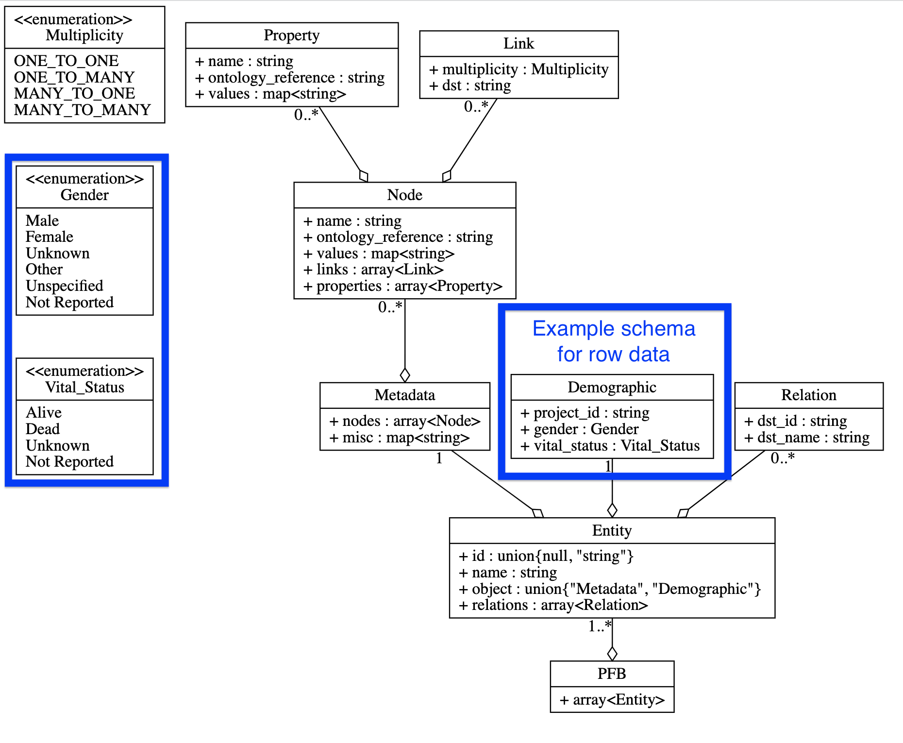

# PFB

The Portable Format for Biomedical Data (PFB) file format is developed by the Center for Translational Data Science at the University of Chicago (UChicago). UChicago developed [pyPFB](https://github.com/uc-cdis/pypfb), a python SDK to create, explore and modify PFB files. They have documentation on the PFB format [here](https://github.com/uc-cdis/pypfb/blob/master/docs/index.md#introduction).

### TLDR;
PFB files are Avro files with a particular required schema designed for biomedical data.

## Building Blocks

### Avro
PFB format is built on [Avro](https://avro.apache.org/docs/), a data serilziation system. When the avro file is deserialized, you'll find the data's schema alongside the row data, all in one compact file. 

### PFB and Avro

PFB requires that the schema defined in the PFB file follows their pre-defined schema.  However, it leaves room for the row data's schema to also be defined.

This is a powerful combination: The required PFB schema means that biomedical data included in the "Metadata" entity will follow the same schema, making it easy to share cross-dataset. However, it allows for full freedom on the schema definitions for the actual data included in the PFB file's row data. 

The PFB schema includes the definition of the schema of the row data. The Metadata and row data is stored side-by-side. 

### PFB Schema

The required PFB schema includes a list of "Entity" objects. The Entity "object" can take two forms: a "Metadata" Entity or a generic table data Entity. PFB requires that there is at least one Entity and that it takes the form of a "Metadata" Entity. The generic table data Entity describes the schema for the actual row data found in the PFB file. 

Within the "Metadata" Entity, biomedical information can be provided in the estalished schema such as the ontology reference or other properties. 

Source (Blue edits are added): https://github.com/uc-cdis/pypfb/blob/master/docs/schema.svg

## Building Blocks of a Dataset

PFB provides everything you need to reconstruct an entire biomedical dataset, including both the tabular data itself and the related schema. Additionally, it tracks key biomedical metadata.  